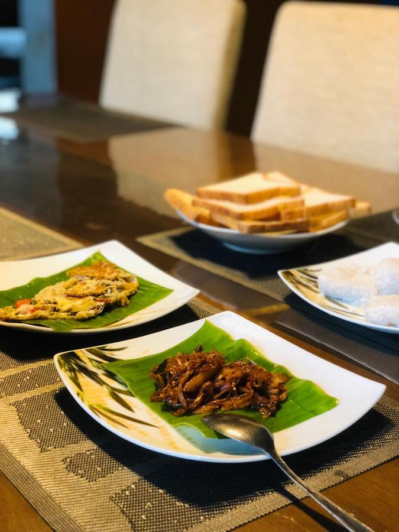
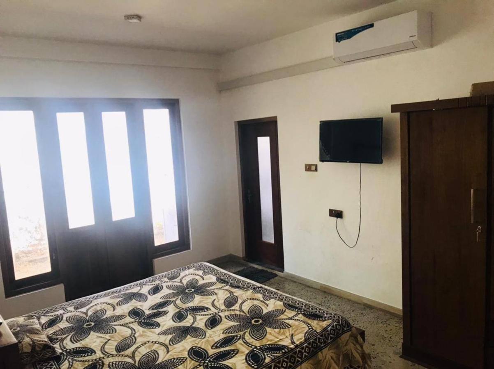
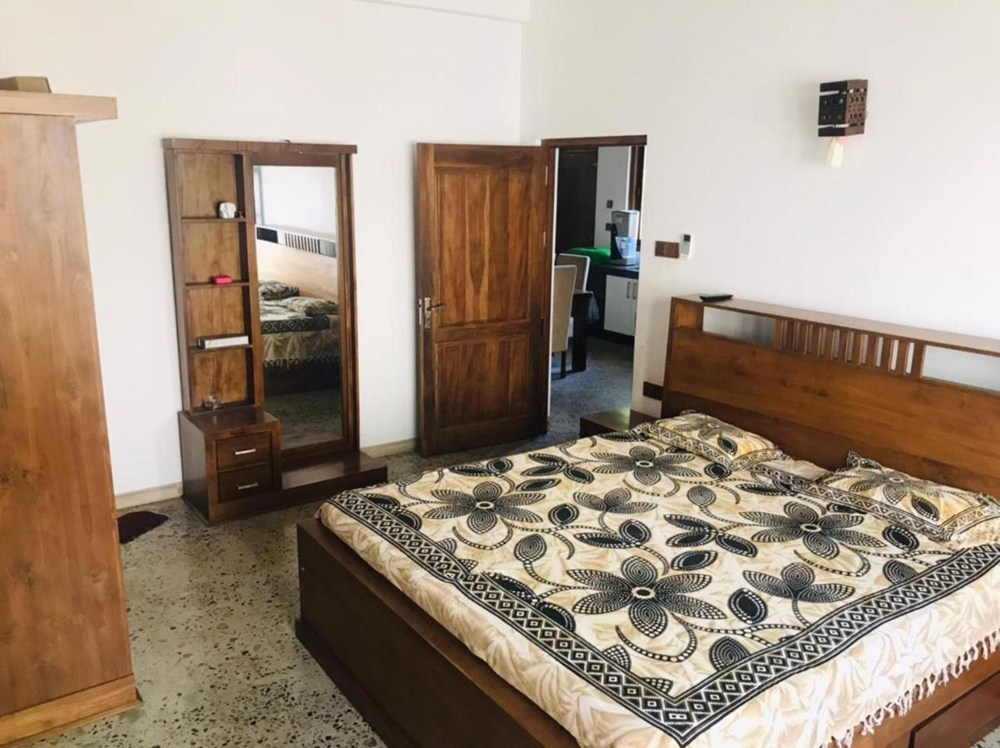
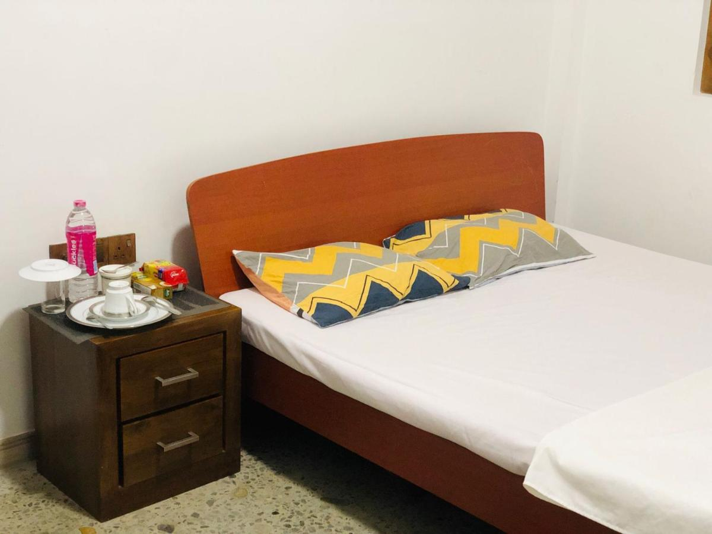
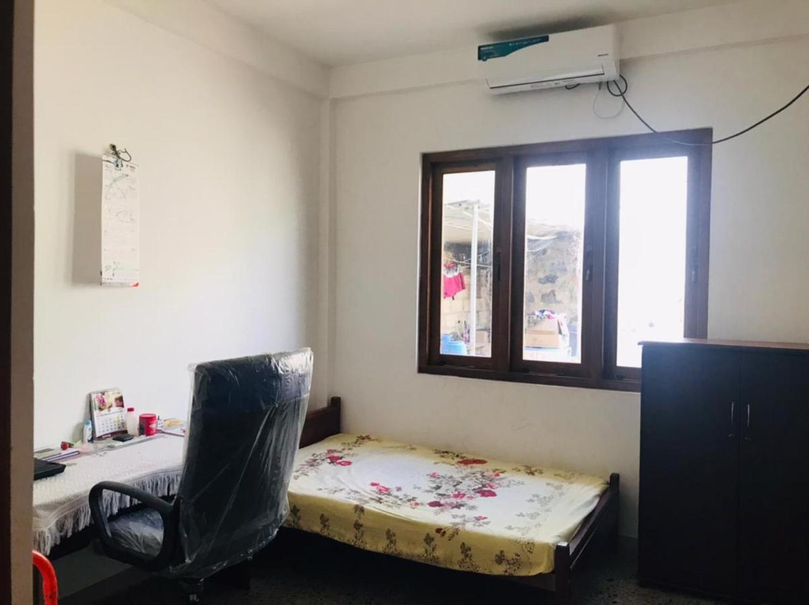
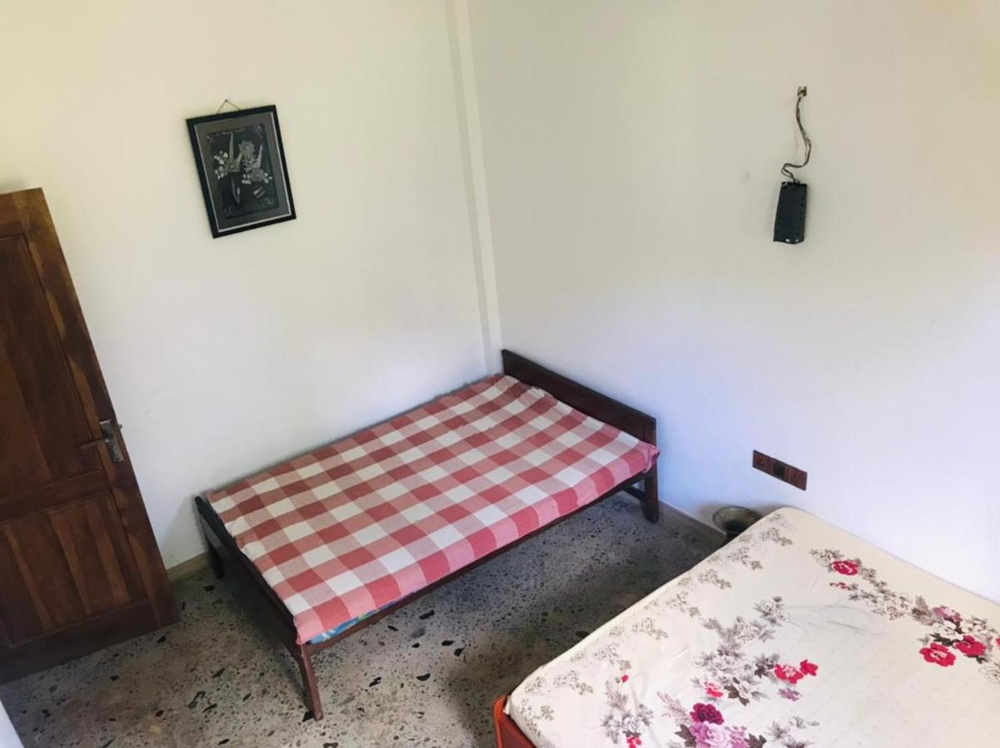
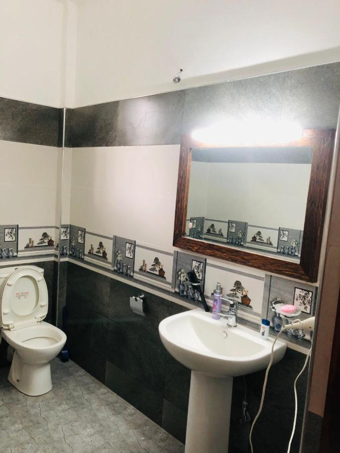

# White-Villa
  <head> <title>"White Villa 19A"</title>
    <link rel="stylesheet" href="style.css"/>
      </head>
  
  <body>
    
    <h1> White Villa   Kandy - Sri Lanka </h1>
    ;
         height="500"
         width="500" >
         
         
       
     <h2> Master Bedroom </h2>
       
  
    
         
  
    <ul> This is the most comfortable and most expensive room. It has following features.
       
       
    
      <li> King Sized Bed and 10 inch spring mattress.
      <li> Large wardrobe
      <li> Attached bathroom with Bathtub
      <li> Open Shower
      <li> AC
      <li> Price per night USD 50
      </li>
      
       
       
       
       
      
    
    <h2> Delux Bed Room </h2>    
       

    
     
    <ul> This is the second expensive room. It has following features.
       
       
      <li> Queen Sized Bed and 6 inch spring mattress
      <li> AC
      <li> Price per night USD 30
      </li>
    
       
       
       
       
       
       
    <h2> Budget room </h2>
       
       
    
    
    <ul> This is the basic room has following features.
      <li> Standered double bed spring mattress
      <li> Fan
      <li> Price per night USD 10
      </li>
    

    <h6> All these photos by Pramod Madushanka CCO </h6>
  
